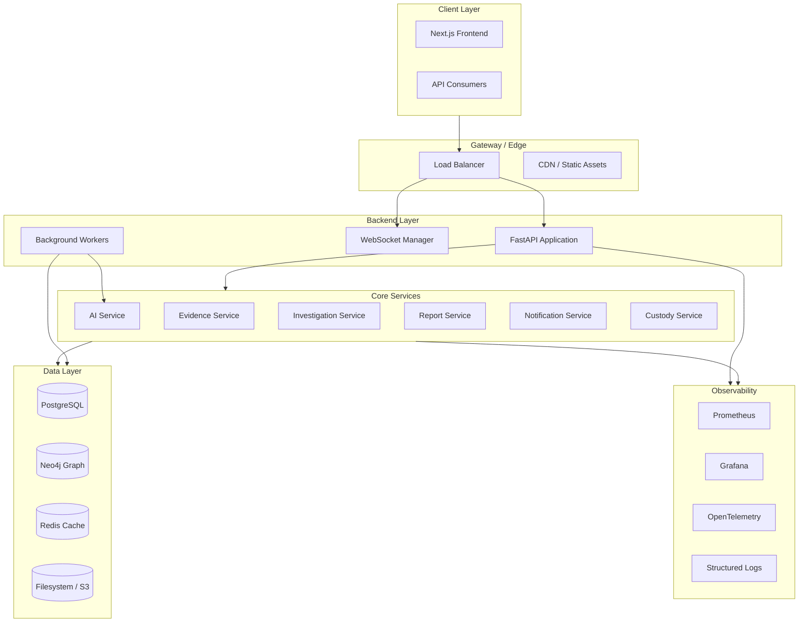
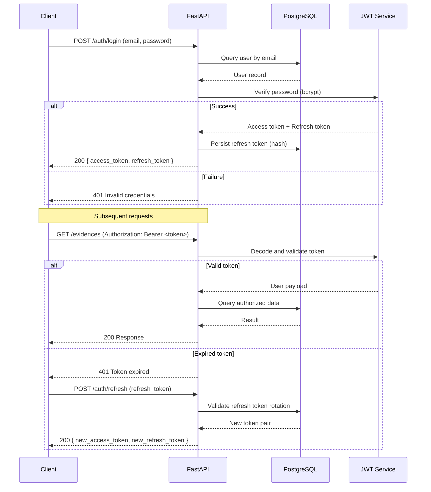
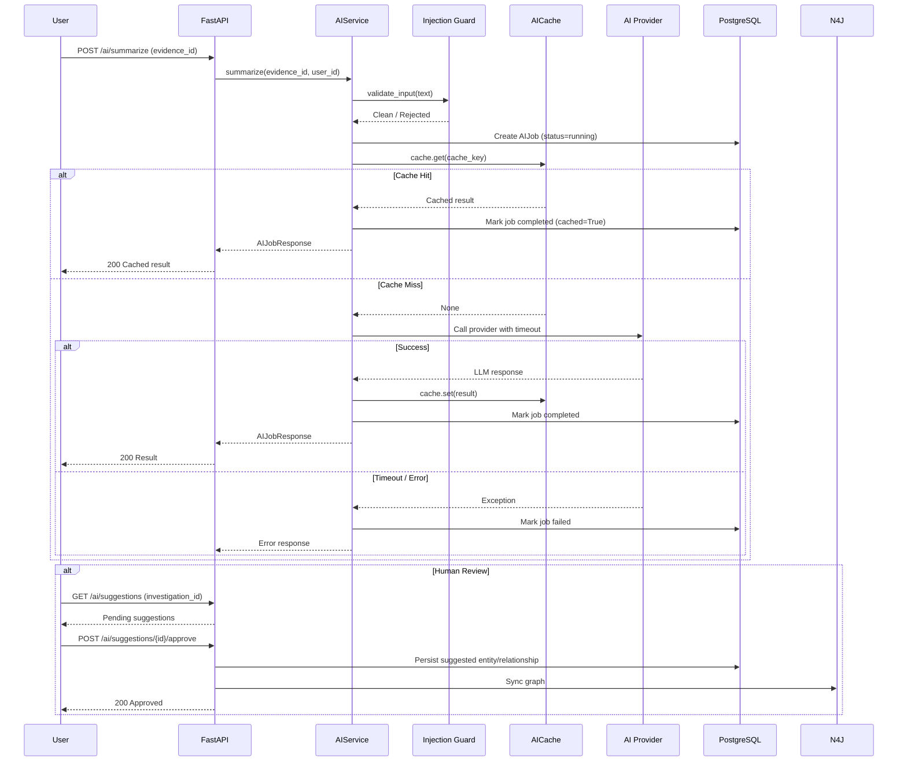
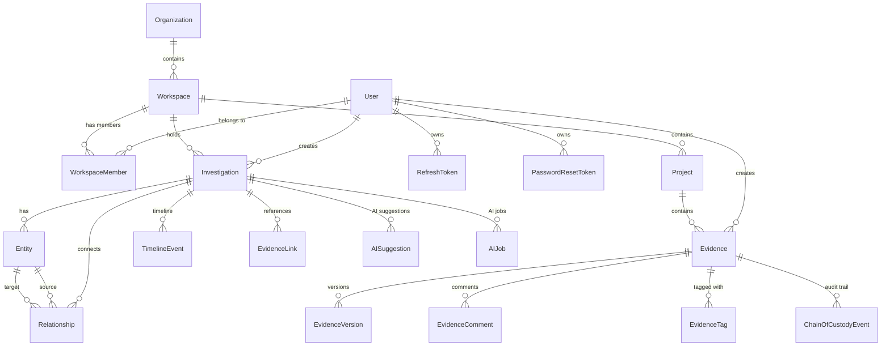
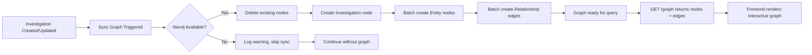
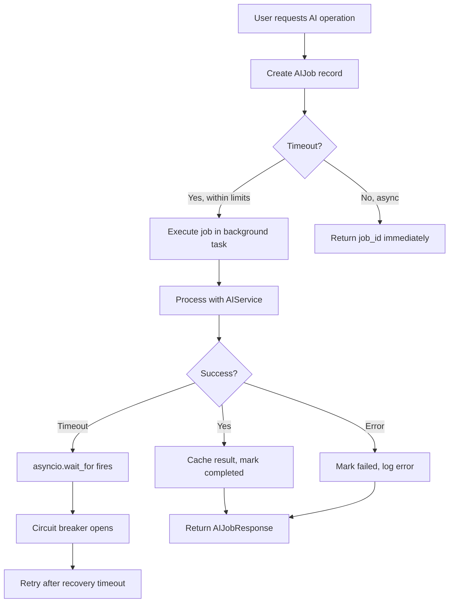
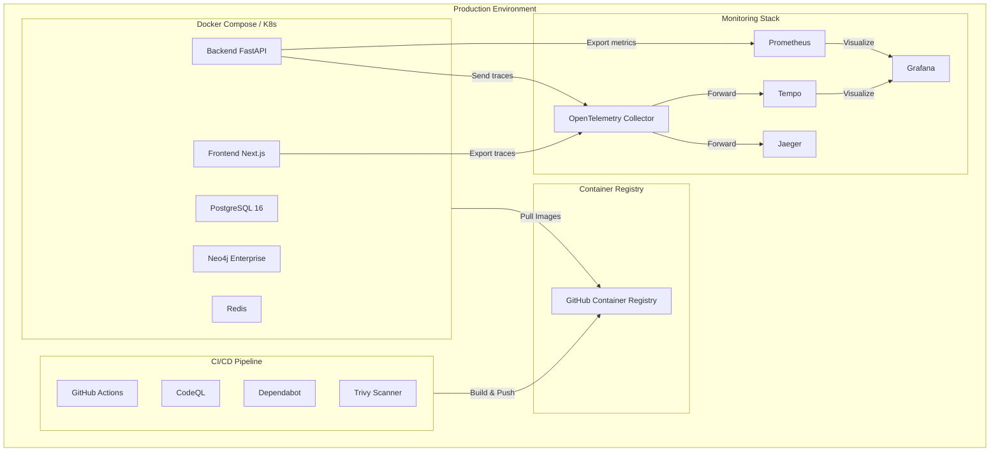
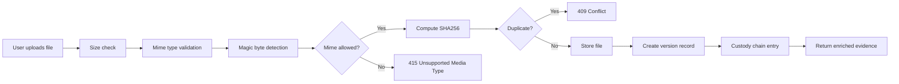

# 🏗️ EchoTrace AI — Architecture

## System Architecture

## Authentication Flow

## AI Processing Pipeline

## Database Entity Relationships

## Knowledge Graph Synchronization

## Background Job Processing

## Deployment Architecture

## Data Flow — Evidence Upload & Verification

---

*For detailed API documentation, refer to the Swagger UI at `/api/v1/docs`.*
*For operational runbooks, see `docs/runbooks/`.*
