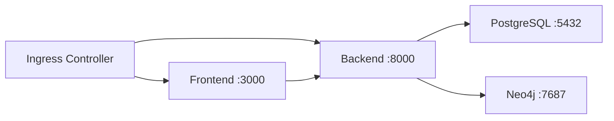

# EchoTrace AI — Kubernetes Production Deployment Guide

This document describes how to deploy EchoTrace AI on Kubernetes in a
production environment.

---

## Table of Contents

- [Prerequisites](#prerequisites)
- [Quick Start](#quick-start)
- [Namespace](#namespace)
- [Configuration & Secrets](#configuration--secrets)
- [Storage](#storage)
- [Database Deployments](#database-deployments)
- [Application Deployments](#application-deployments)
- [Ingress & TLS](#ingress--tls)
- [Autoscaling](#autoscaling)
- [Pod Disruption Budgets](#pod-disruption-budgets)
- [Network Policies](#network-policies)
- [Service Accounts](#service-accounts)
- [Monitoring](#monitoring)
- [Operational Guide](#operational-guide)
- [Rollback Procedure](#rollback-procedure)
- [Upgrade Procedure](#upgrade-procedure)
- [Scaling](#scaling)
- [Debugging](#debugging)

---

## Prerequisites

- Kubernetes cluster 1.28+ (EKS, GKE, AKS, or self-managed)
- `kubectl` configured with cluster admin access
- [NGINX Ingress Controller](https://kubernetes.github.io/ingress-nginx/deploy/) installed
- [cert-manager](https://cert-manager.io/docs/installation/) installed (for automatic TLS)
- [Metrics Server](https://github.com/kubernetes-sigs/metrics-server) installed (for HPA)

### Verify prerequisites

```bash
kubectl cluster-info
kubectl get nodes
kubectl get pods -n ingress-nginx
kubectl get pods -n cert-manager
kubectl top nodes
```

---

## Quick Start

```bash
# 1. Create the namespace first
kubectl apply -f k8s/namespace.yaml

# 2. Create secrets from your .env.prod file
cp k8s/secret.example.yaml k8s/secrets.yaml
# Edit k8s/secrets.yaml with your production secrets
kubectl apply -f k8s/secrets.yaml

# 3. Apply ConfigMap
kubectl apply -f k8s/configmap.yaml

# 4. Apply storage (PVCs)
kubectl apply -f k8s/storage-pvc.yaml

# 5. Apply service accounts
kubectl apply -f k8s/serviceaccount.yaml

# 6. Apply databases
kubectl apply -f k8s/postgres.yaml
kubectl apply -f k8s/neo4j.yaml

# 7. Wait for databases to be ready
kubectl wait --for=condition=ready pod -l app.kubernetes.io/component=postgres -n echotrace --timeout=180s
kubectl wait --for=condition=ready pod -l app.kubernetes.io/component=neo4j -n echotrace --timeout=300s

# 8. Apply applications
kubectl apply -f k8s/backend.yaml
kubectl apply -f k8s/frontend.yaml

# 9. Apply autoscaling and availability
kubectl apply -f k8s/hpa.yaml
kubectl apply -f k8s/pdb.yaml

# 10. Apply networking
kubectl apply -f k8s/network-policy.yaml

# 11. Apply TLS issuer (requires cert-manager)
kubectl apply -f k8s/cluster-issuer.yaml

# 12. Apply ingress
kubectl apply -f k8s/ingress.yaml

# 13. Verify deployment
kubectl get all -n echotrace
kubectl get pods -n echotrace -w
```

---

## Namespace

All EchoTrace resources are deployed in the `echotrace` namespace.

```bash
kubectl apply -f k8s/namespace.yaml
```

The namespace includes standard Kubernetes labels for resource discovery:

| Label | Value |
|-------|-------|
| `name` | `echotrace` |
| `environment` | `production` |
| `app.kubernetes.io/name` | `echotrace-ai` |
| `app.kubernetes.io/part-of` | `echotrace` |

---

## Configuration & Secrets

### ConfigMap

The ConfigMap (`k8s/configmap.yaml`) contains all non-sensitive configuration.
Apply it with:

```bash
kubectl apply -f k8s/configmap.yaml
```

### Secrets

**Never commit secrets to version control.**

1. Copy the example file:
   ```bash
   cp k8s/secret.example.yaml k8s/secrets.yaml
   ```

2. Edit `k8s/secrets.yaml` with production values:
   ```bash
   # Generate required secrets
   openssl rand -hex 32   # For SECRET_KEY
   openssl rand -hex 32   # For POSTGRES_PASSWORD
   openssl rand -hex 32   # For NEO4J_PASSWORD
   ```

3. Apply:
   ```bash
   kubectl apply -f k8s/secrets.yaml
   ```

**Production secret management options:**

| Method | Tool | Documentation |
|--------|------|---------------|
| External Secrets Operator | [external-secrets](https://external-secrets.io/) | Syncs from AWS/GCP/Azure |
| Sealed Secrets | [bitnami/sealed-secrets](https://github.com/bitnami-labs/sealed-secrets) | Encrypts secrets in git |
| HashiCorp Vault | [vault-csi-provider](https://developer.hashicorp.com/vault/docs/platform/k8s/csi) | Dynamic secrets |
| AWS Secrets Manager | [aws-secrets-manager](https://docs.aws.amazon.com/secretsmanager/latest/userguide/integrating_csi_driver.html) | Native AWS integration |

### Required environment variables

| Variable | Source | Description |
|----------|--------|-------------|
| `SECRET_KEY` | Secret | JWT signing key (min 32 chars) |
| `POSTGRES_PASSWORD` | Secret | PostgreSQL password |
| `NEO4J_PASSWORD` | Secret | Neo4j password |
| `DATABASE_URL` | Derived | Async PostgreSQL connection string |
| `DATABASE_SYNC_URL` | Derived | Sync PostgreSQL connection string |

---

## Storage

Persistent volumes are provisioned via PVCs defined in `k8s/storage-pvc.yaml`:

| PVC Name | Size | Mounted By | Purpose |
|----------|------|------------|---------|
| `echotrace-postgres` | 10 Gi | postgres | Database files |
| `echotrace-neo4j-data` | 20 Gi | neo4j | Graph database files |
| `echotrace-neo4j-logs` | 5 Gi | neo4j | Transaction logs |
| `echotrace-storage` | 50 Gi | backend | File uploads |

The default `storageClassName` is `standard`. In production environments, use
an SSD-backed storage class for better database performance.

```bash
# Monitor PVC status
kubectl get pvc -n echotrace

# Check PV binding details
kubectl describe pvc echotrace-postgres -n echotrace
```

---

## Database Deployments

### PostgreSQL

| Property | Value |
|----------|-------|
| Image | `postgres:16-alpine` |
| Port | 5432 |
| Replicas | 1 (stateful, Recreate strategy) |
| Storage | 10 Gi via PVC |
| Readiness | `pg_isready` |
| Liveness | `pg_isready` |
| Security | Non-root (UID 999), read-only FS disabled |
| PDB | maxUnavailable 0 |

```bash
# Check PostgreSQL health
kubectl exec -n echotrace deploy/postgres -- pg_isready -U echotrace

# Connect to PostgreSQL
kubectl exec -it -n echotrace deploy/postgres -- psql -U echotrace
```

### Neo4j

| Property | Value |
|----------|-------|
| Image | `neo4j:5-enterprise` |
| Ports | 7687 (bolt), 7474 (HTTP) |
| Replicas | 1 (stateful, Recreate strategy) |
| Storage | 20 Gi (data) + 5 Gi (logs) |
| Readiness | `cypher-shell RETURN 1` |
| Liveness | `cypher-shell RETURN 1` |
| Security | Non-root (UID 7474), read-only FS disabled |
| PDB | maxUnavailable 0 |

```bash
# Check Neo4j health
kubectl exec -n echotrace deploy/neo4j -- cypher-shell -u neo4j -p $NEO4J_PASSWORD "RETURN 1"

# Run a Cypher query
kubectl exec -n echotrace deploy/neo4j -- cypher-shell -u neo4j -p $NEO4J_PASSWORD "MATCH (n) RETURN count(n)"
```

---

## Application Deployments

### Backend (FastAPI)

| Property | Value |
|----------|-------|
| Image | `ghcr.io/prayushsinghrathore/echotrace-backend` |
| Port | 8000 |
| Replicas | 3 (default, auto-scaled 3–10) |
| Strategy | RollingUpdate (maxSurge: 1, maxUnavailable: 0) |
| Readiness | `GET /api/v1/ready` |
| Liveness | `GET /api/v1/live` |
| Security | UID 1001, readOnlyRootFilesystem: true |
| Service Account | `echotrace-backend` |

**Container security context:**
```yaml
securityContext:
  runAsNonRoot: true
  runAsUser: 1001
  runAsGroup: 1001
  readOnlyRootFilesystem: true
  allowPrivilegeEscalation: false
  capabilities:
    drop:
      - ALL
```

### Frontend (Next.js)

| Property | Value |
|----------|-------|
| Image | `ghcr.io/prayushsinghrathore/echotrace-frontend` |
| Port | 3000 |
| Replicas | 2 (default, auto-scaled 2–8) |
| Strategy | RollingUpdate (maxSurge: 1, maxUnavailable: 0) |
| Readiness | `GET /` |
| Liveness | `GET /` |
| Security | UID 1001, readOnlyRootFilesystem: true |
| Service Account | `echotrace-frontend` |

---

## Ingress & TLS

The ingress (`k8s/ingress.yaml`) routes traffic through NGINX Ingress Controller:

| Host | Backend Service | Port |
|------|----------------|------|
| `api.echotrace.example.com` | backend | 8000 |
| `app.echotrace.example.com` | frontend | 3000 |

### TLS

- **Automatic certificates** via Let's Encrypt (cert-manager `ClusterIssuer`)
- **TLS termination** at the ingress (no TLS passthrough)
- **HTTP→HTTPS redirect** forced (301)
- **HSTS** enabled (max-age: 1 year, includeSubDomains, preload)

### Ingress annotations

```yaml
annotations:
  kubernetes.io/ingress.class: "nginx"
  cert-manager.io/cluster-issuer: "letsencrypt-prod"
  nginx.ingress.kubernetes.io/ssl-redirect: "true"
  nginx.ingress.kubernetes.io/proxy-body-size: "500m"
  nginx.ingress.kubernetes.io/enable-gzip: "true"
```

### Verify ingress

```bash
kubectl get ingress -n echotrace
kubectl describe ingress echotrace-ingress -n echotrace
kubectl get certificate -n echotrace
```

### Update DNS

Point your DNS records to the ingress controller's external IP:

```bash
kubectl get svc -n ingress-nginx ingress-nginx-controller
```

---

## Autoscaling

Horizontal Pod Autoscalers are configured for stateless application tiers:

| HPA | Min | Max | CPU Target | Memory Target |
|-----|-----|-----|------------|---------------|
| Backend | 3 | 10 | 70% | 70% |
| Frontend | 2 | 8 | 70% | 70% |

### Scaling behaviour

```yaml
behavior:
  scaleUp:
    stabilizationWindowSeconds: 60
    policies:
      - type: Pods
        value: 2
        periodSeconds: 60
  scaleDown:
    stabilizationWindowSeconds: 120
    policies:
      - type: Pods
        value: 1
        periodSeconds: 120
```

- **Scale up**: adds up to 2 pods every 60 seconds (no cooldown window)
- **Scale down**: removes 1 pod every 120 seconds (2-minute cooldown)

Manually test scaling:

```bash
# Simulate load
kubectl run -i --tty load-generator --rm --image=busybox --restart=Never -- \
  sh -c "while true; do wget -q -O- http://backend:8000/api/v1/live; done"

# Check HPA status
kubectl get hpa -n echotrace -w
```

---

## Pod Disruption Budgets

PDBs ensure availability during voluntary disruptions (node drains, cluster upgrades):

| PDB | Target | Min Available | Max Unavailable |
|-----|--------|---------------|-----------------|
| Backend | 3 pods | 2 | - |
| Frontend | 2 pods | 1 | - |
| PostgreSQL | 1 pod | - | 0 |
| Neo4j | 1 pod | - | 0 |

```bash
# Check PDB status
kubectl get pdb -n echotrace
kubectl describe pdb echotrace-backend-pdb -n echotrace
```

---

## Network Policies

The network policy layer (`k8s/network-policy.yaml`) implements zero-trust
networking:



| Policy | Effect |
|--------|--------|
| `default-deny-all` | Drops all ingress and egress traffic by default |
| `allow-dns-egress` | Allows DNS resolution (port 53 UDP/TCP) |
| `allow-ingress-controller` | Allows ingress-nginx to reach backend and frontend |
| `allow-backend-to-postgres` | Backend → PostgreSQL (port 5432) |
| `allow-backend-to-neo4j` | Backend → Neo4j (port 7687) |
| `allow-healthcheck` | Backend egress to databases |

```bash
# Verify network policies
kubectl get networkpolicies -n echotrace
kubectl describe networkpolicy default-deny-all -n echotrace
```

> **Note**: Network policies require a CNI plugin that supports them (Calico,
> Cilium, Weave Net, or GKE/AKS/EKS native). The default `flannel` or `kubenet`
> CNI does not enforce network policies.

---

## Service Accounts

| Service Account | Namespace | Automount Token | Used By |
|-----------------|-----------|----------------|---------|
| `echotrace-backend` | echotrace | Yes | Backend pods |
| `echotrace-frontend` | echotrace | No | Frontend pods |

The backend service account can be extended with RBAC rules if backend
services need to interact with the Kubernetes API (e.g., for leader election).

---

## Monitoring

### Prometheus annotations

Pod annotations for Prometheus auto-discovery are set on the backend deployment:

```yaml
annotations:
  prometheus.io/scrape: "true"
  prometheus.io/port: "8000"
  prometheus.io/path: "/api/v1/metrics"
```

### Key metrics endpoints

| Service | Endpoint | Description |
|---------|----------|-------------|
| Backend | `GET /api/v1/metrics` | Prometheus metrics |
| Backend | `GET /api/v1/live` | Liveness check (200 OK) |
| Backend | `GET /api/v1/ready` | Readiness check (200 OK) |

### Logging

All pods log to stdout/stderr (JSON format). Collect logs with your cluster
logging stack:

```bash
# View logs
kubectl logs -n echotrace -l app.kubernetes.io/component=backend -f

# Tail with timestamps
kubectl logs -n echotrace deploy/echotrace-backend -f --timestamps
```

---

## Operational Guide

### View all resources

```bash
kubectl get all -n echotrace
```

### Watch pods

```bash
kubectl get pods -n echotrace -w
```

### Get pod logs

```bash
kubectl logs -n echotrace deploy/echotrace-backend -f
kubectl logs -n echotrace deploy/echotrace-frontend -f --tail=50
```

### Execute commands in a pod

```bash
kubectl exec -it -n echotrace deploy/echotrace-backend -- sh
kubectl exec -it -n echotrace deploy/postgres -- psql -U echotrace
```

### Port forwarding (for debugging)

```bash
kubectl port-forward -n echotrace svc/backend 8000:8000
kubectl port-forward -n echotrace svc/frontend 3000:3000
kubectl port-forward -n echotrace svc/postgres 5432:5432
```

### View resource usage

```bash
kubectl top pods -n echotrace
kubectl top nodes
```

### Describe a failing pod

```bash
kubectl describe pod -n echotrace -l app.kubernetes.io/component=backend
```

---

## Rollback Procedure

### Rollback a deployment

```bash
# View revision history
kubectl rollout history deployment/echotrace-backend -n echotrace

# Rollback to previous revision
kubectl rollout undo deployment/echotrace-backend -n echotrace

# Rollback to specific revision
kubectl rollout undo deployment/echotrace-backend -n echotrace --to-revision=3

# Monitor rollback
kubectl rollout status deployment/echotrace-backend -n echotrace
```

### Rollback an image

```bash
# Set the image to a specific tag
kubectl set image deployment/echotrace-backend -n echotrace \
  backend=ghcr.io/prayushsinghrathore/echotrace-backend:v1.2.3
```

### Rollback full stack

```bash
# Rollback all application deployments
kubectl rollout undo deployment/echotrace-backend -n echotrace
kubectl rollout undo deployment/echotrace-frontend -n echotrace
```

> **Note**: Database rollbacks (PostgreSQL, Neo4j) are not automated.
> Database schema changes via Alembic are forward-only. To reverse a migration,
> run `alembic downgrade` manually or restore from backup.

---

## Upgrade Procedure

### Standard application upgrade

```bash
# 1. Update the image tag in backend.yaml or frontend.yaml
# 2. Apply the change
kubectl apply -f k8s/backend.yaml

# 3. Monitor rollout
kubectl rollout status deployment/echotrace-backend -n echotrace -w

# 4. Verify health
kubectl get pods -n echotrace
curl https://api.echotrace.example.com/api/v1/live
```

### Blue-green deployment (manual)

```yaml
# Temporarily change the label selector to the new version
# Deploy with a different tag, then switch the service selector:
selector:
  app.kubernetes.io/component: backend
  app.kubernetes.io/version: "2.0.0"
```

### Database migration-aware upgrade

```bash
# 1. Ensure the backend image has the correct Alembic migration
# 2. Scale down frontend (optional)
kubectl scale deployment/echotrace-frontend -n echotrace --replicas=0

# 3. Deploy new backend — migrations run automatically via entrypoint.sh
kubectl set image deployment/echotrace-backend -n echotrace \
  backend=ghcr.io/prayushsinghrathore/echotrace-backend:v2.0.0

# 4. Wait for backend rollout
kubectl rollout status deployment/echotrace-backend -n echotrace -w

# 5. Scale frontend back up
kubectl scale deployment/echotrace-frontend -n echotrace --replicas=2
```

---

## Scaling

### Manual scaling

```bash
# Scale backend to 5 replicas
kubectl scale deployment/echotrace-backend -n echotrace --replicas=5

# Scale frontend to 3 replicas
kubectl scale deployment/echotrace-frontend -n echotrace --replicas=3
```

### Configure HPA thresholds

```bash
# Edit HPA to change thresholds
kubectl edit hpa echotrace-backend-hpa -n echotrace

# Set different CPU target (e.g., 80%)
kubectl autoscale deployment echotrace-backend -n echotrace \
  --cpu-percent=80 --min=3 --max=10 --dry-run=client -o yaml | kubectl apply -f -
```

### Database scaling

PostgreSQL and Neo4j are deployed as single-replica stateful services. To scale
databases:

1. **Vertical scaling**: Increase resource limits in the deployment
2. **Horizontal scaling**: Requires read replicas (outside scope)

---

## Debugging

### Pod not starting

```bash
# Check pod status and events
kubectl describe pod -n echotrace -l app.kubernetes.io/component=backend

# Check pod logs
kubectl logs -n echotrace -l app.kubernetes.io/component=backend --tail=100

# Check previous pod logs (if restarting)
kubectl logs -n echotrace -l app.kubernetes.io/component=backend --previous
```

### Image pull failure

```bash
# Check if the image exists
kubectl describe pod -n echotrace -l app.kubernetes.io/component=backend | grep -A 5 "Image"

# Verify GitHub Container Registry authentication
kubectl get secrets -n echotrace
# If using imagePullSecrets, verify it exists and is correct
```

### Database connection issues

```bash
# Check if database is running
kubectl get pods -n echotrace -l app.kubernetes.io/component=postgres

# Check database logs
kubectl logs -n echotrace deploy/postgres --tail=50

# Test connectivity from backend pod
kubectl exec -n echotrace deploy/echotrace-backend -- \
  curl -f http://postgres:5432/ || echo "unreachable"
```

### Network policy blocking traffic

```bash
# Check if network policies exist
kubectl get networkpolicies -n echotrace

# Temporarily disable network policy for debugging (label)
kubectl label pod <pod-name> -n echotrace "network-policy=debug"

# Run a temporary debug pod
kubectl run -it --rm debug -n echotrace --image=nicolaka/netshoot -- /bin/bash
```

### Certificate issues

```bash
# Check certificate status
kubectl get certificate -n echotrace
kubectl describe certificate echotrace-tls -n echotrace

# Check ClusterIssuer
kubectl get clusterissuer
kubectl describe clusterissuer letsencrypt-prod

# Check certificate request
kubectl get certificaterequest -n echotrace
```

### Resource constraints

```bash
# Check resource usage
kubectl top pods -n echotrace

# Check HPA status
kubectl get hpa -n echotrace

# Check if pods are being OOMKilled
kubectl describe pod -n echotrace -l app.kubernetes.io/component=backend | grep -A 10 "Last State"

# Increase resource limits temporarily
kubectl set resources deployment/echotrace-backend -n echotrace \
  --limits=memory=2Gi,cpu=2000m \
  --requests=memory=512Mi,cpu=500m
```

### Common failure scenarios

| Symptom | Likely Cause | Resolution |
|---------|-------------|------------|
| CrashLoopBackOff | Missing SECRET_KEY | Check secrets |
| ImagePullBackOff | Wrong image tag | Verify image in GHCR |
| Pending (no node) | Insufficient resources | Check node capacity |
| Pending (PVC) | Storage class missing | Verify storage class |
| Unhealthy | Migration failure | Check backend logs |
| TLS error | Certificate not issued | Check cert-manager logs |
| 503 errors | Backend not ready | Check readiness probe |
